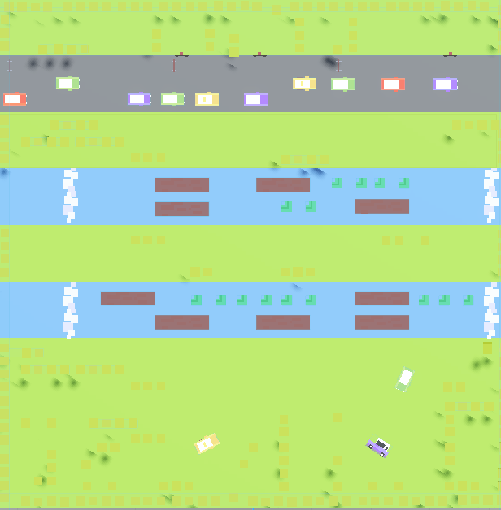
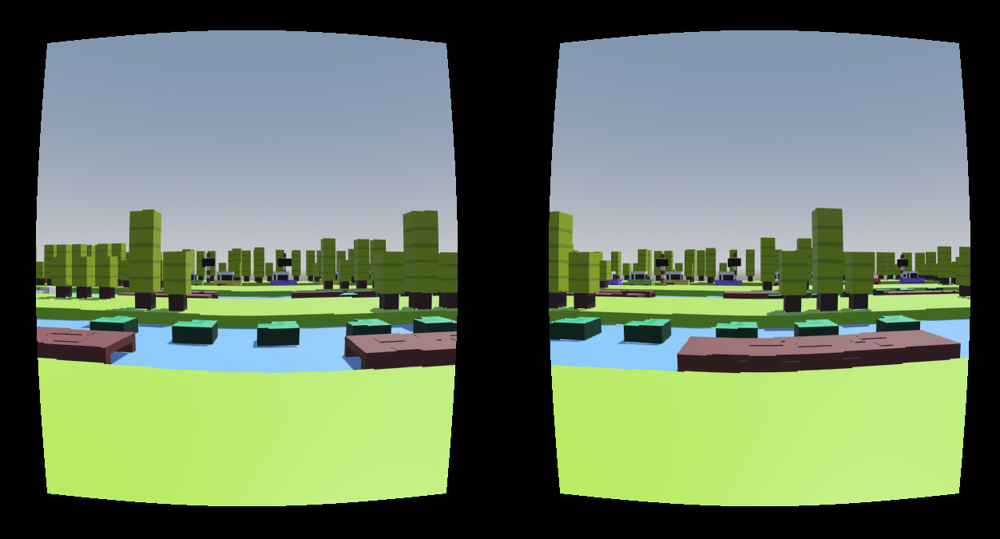
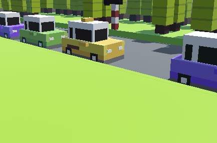

# 🎮 **AnyiRoad -- Simulación 3D en Godot**

**AnyiRoad** es un juego 3D inspirado en la franquicia CrazyRoad y la
estética de Crossy Road. Fue desarrollado como parte de la asignatura
**Simulación por Computadora** del **CUCEI -- Universidad de Guadalajara
(UdG)**.\
El proyecto combina modelado 3D, programación en Godot, integración con
**Google Cardboard** y soporte para **control de Xbox**.

## 🚀 **Características Principales**

-   🌐 Entorno 3D estilo low-poly.
-   🎮 Compatible con visores **Google Cardboard**.
-   🕹️ Soporte para **control de Xbox**.
-   🎨 Modelado en **Blender**.
-   ⚙️ Programación realizada en **Godot Engine**.
-   🚗 Jugabilidad basada en esquivar autos y avanzar a través del mapa.

## 🕹️ **Controles**

### Control de Xbox

-   **Joystick izquierdo:** movimiento hacia adelante, atrás y
    laterales.\
-   **Botón A:** saltar.

### Modo VR (Cardboard)

-   Navegación mediante orientación del dispositivo.\
-   Cámara doble para visión estereoscópica.

------------------------------------------------------------------------
## 📥 Descarga del Juego

Puedes descargar y jugar **AnyiRoad** desde su página oficial en Itch.io:

🔗 https://annyigs.itch.io/anyiroad

------------------------------------------------------------------------

## 🖼️ **Galería del Proyecto**

### 🗺️ Mapa del Juego

------------------------------------------------------------------------

### 🎮 Vista del Juego

------------------------------------------------------------------------

### 📍 Zonas del Escenario

------------------------------------------------------------------------

## 🎥 **Video de Demostración**

🔗 **YouTube:** https://youtu.be/gNZU4hjWHdc

## 🛠️ **Tecnologías Utilizadas**

-   **Godot Engine 4**\
-   **Blender 3D**\
-   **Google Cardboard VR**\
-   **Control de Xbox (InputMap)**

## 📚 **Créditos**

Proyecto desarrollado como parte de la clase **Simulación por
Computadora**, dentro del plan académico del **CUCEI -- Universidad de
Guadalajara (UdG)**.

**Desarrollo completo:**\
👤 *Andrea Ortega* --- modelado 3D, integración VR, programación, diseño
y ensamblaje del juego.

## 📌 **Estructura del Proyecto**

    AnyiRoad/
    │
    ├── anyi-road-(copy)-complete # Carpeta con el proyecto en Godot Engine 4                   
    ├── AnyiCorp_AnyiRoad/ # Carpeta con imágenes del proyecto
    ├── README.md          

